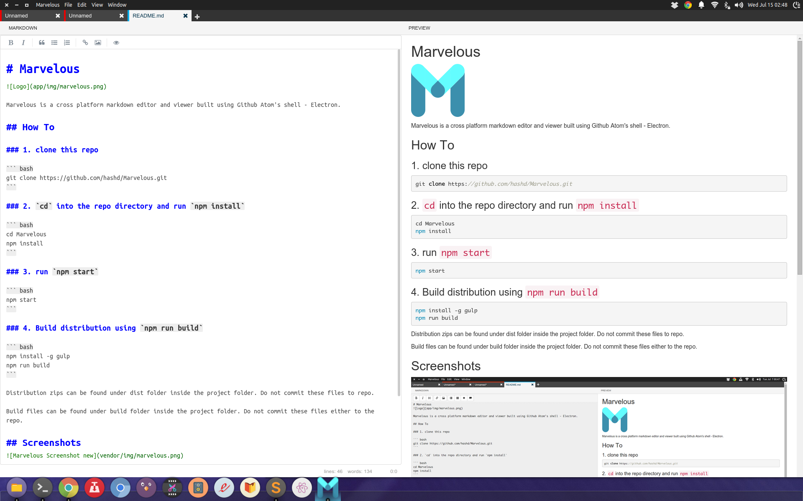
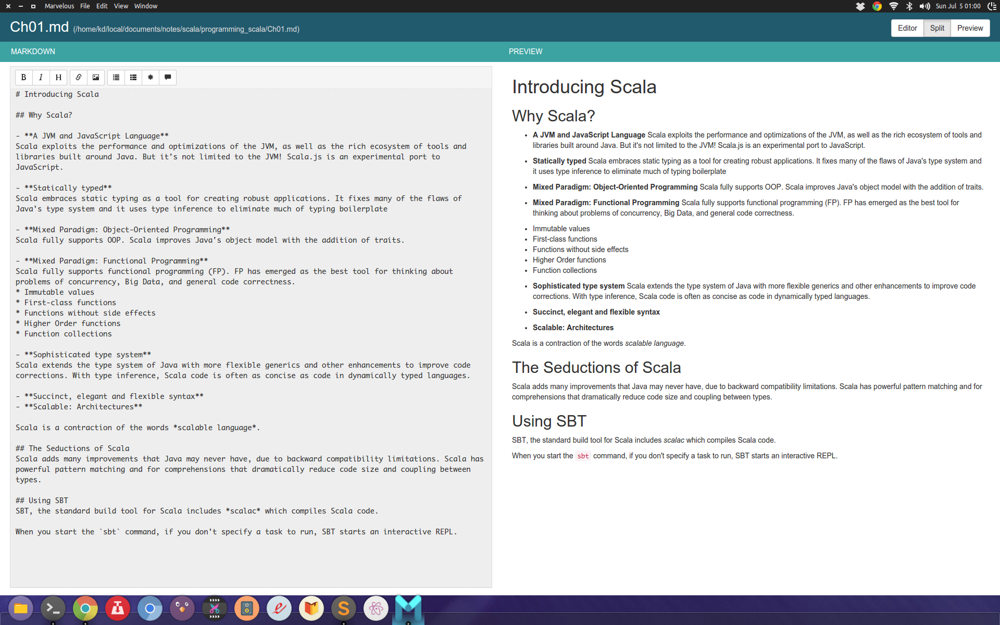

# Marvelous


Marvelous is a cross-platform Markdown editor and viewer built using [Electron](http://electron.atom.io/).

## Installation

#### Clone
``` bash
git clone https://github.com/hashd/Marvelous.git
```

#### Setup Dependencies

``` bash
cd Marvelous
npm install
```

#### Run

``` bash
npm start
```

## Build Distribution

Make sure you have [Gulp](http://gulpjs.com) installed globally. 
```bash
npm install -g gulp
```
Now build it from project root.

``` bash
npm run build
```

**Build files** can be found in `/build` directory.

**Distribution archives** can be found in `/dist` directory. 


## Issues & Feature Request
Go through the open [issues](https://github.com/hashd/Marvelous/issues)  before raising one. Check the [milestones](https://github.com/hashd/Marvelous/milestones) to know what's currently brewing! 

## Screenshots




## Contributing
Your contribution will be awesome! Go through the list of [open issues](https://github.com/hashd/Marvelous/issues), pick an issue, fix, and send a pull request.

## Contributors
- [Kiran Danduprolu](https://www.github.com/hashd)
- Vamsi Kumar Chava
- Sudhir Chokakula
- Srikanth P
- [Praveen Puglia](https://www.github.com/praveenpuglia)

## License
[MIT](LICENSE.md)
